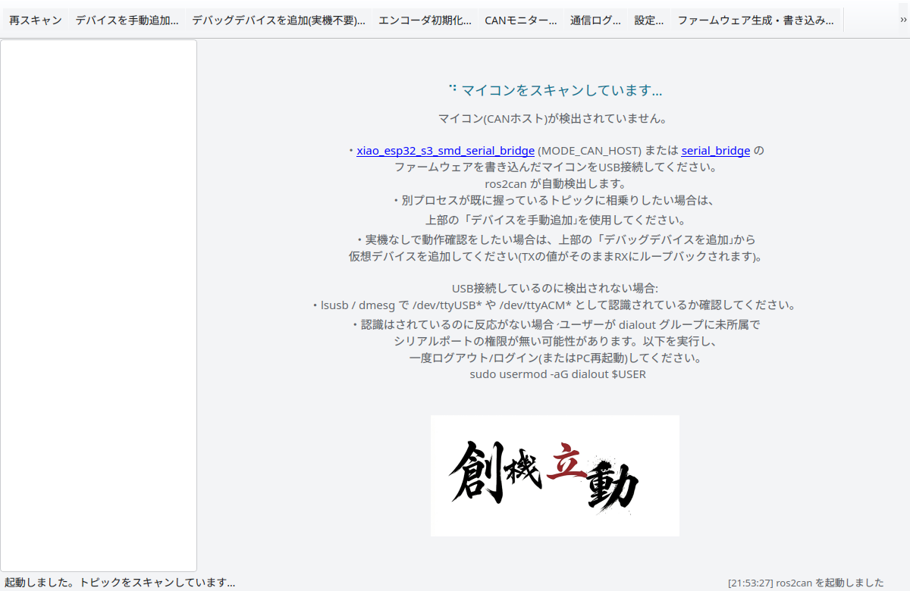
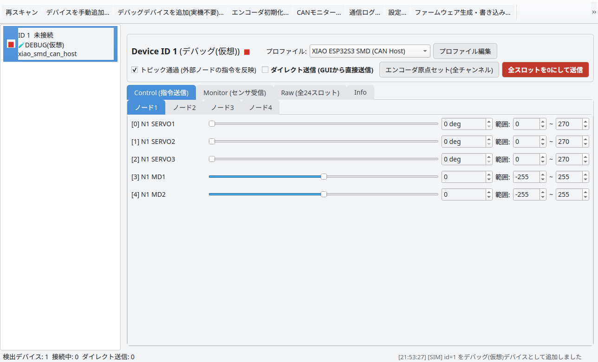
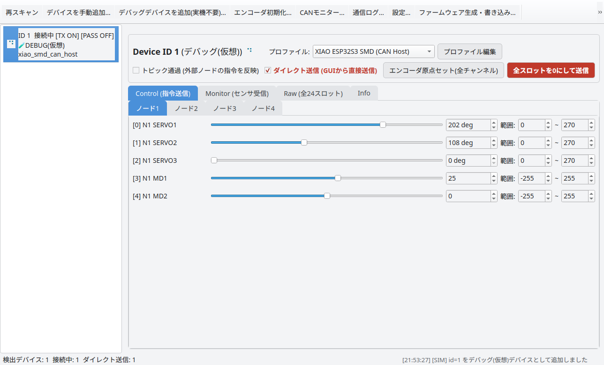
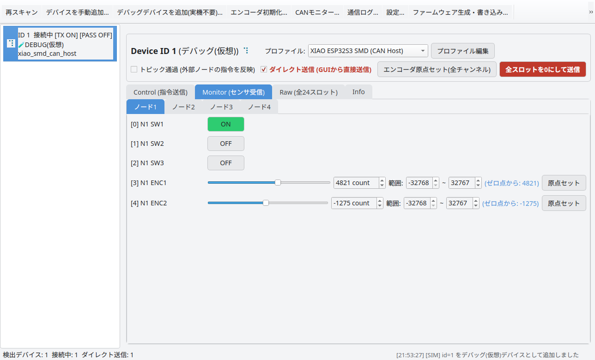
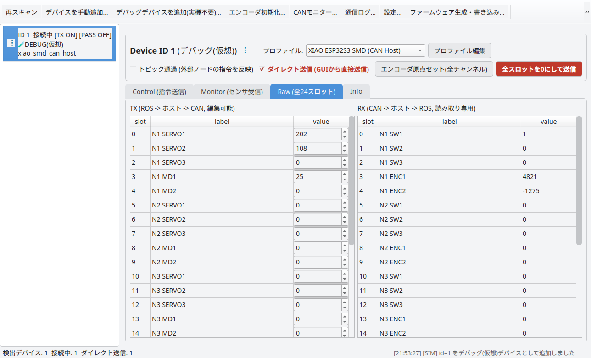
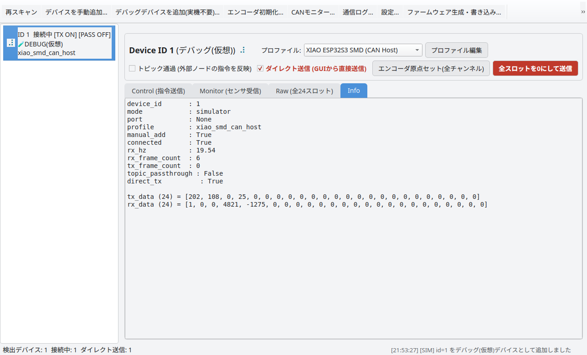
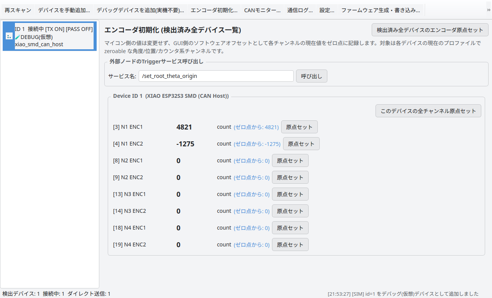
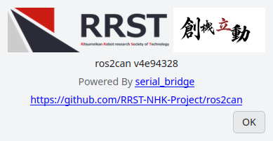

> 本ページは [ros2can](https://github.com/RRST-NHK-Project/ros2can) パッケージの使い方説明書です。
> `xiao_esp32_s3_smd_serial_bridge`（MODE_CAN_HOST）専用のスタンドアローンGUIで、
> シリアルポートのスキャン・専有・serial_bridge 互換フレームの送受信を自前で行います。

## 目次

- [1. 概要](#1-概要)
- [2. システム要件](#2-システム要件)
- [3. インストールと起動](#3-インストールと起動)
- [4. 起動直後の画面](#4-起動直後の画面)
- [5. デバッグモード（実機不要でのUI確認）](#5-デバッグモード実機不要でのui確認)
- [6. 画面構成](#6-画面構成)
  - [6.1 Control タブ（指令送信）](#61-control-タブ指令送信)
  - [6.2 Monitor タブ（センサ受信）](#62-monitor-タブセンサ受信)
  - [6.3 Raw タブ（全24スロット）](#63-raw-タブ全24スロット)
  - [6.4 Info タブ](#64-info-タブ)
- [7. 設定](#7-設定)
- [8. エンコーダ初期化](#8-エンコーダ初期化)
- [9. 安全機能について](#9-安全機能について)
- [10. About](#10-about)

---

## 1. 概要

`ros2can` は、CANバス経由で複数マイコンをホストする `xiao_esp32_s3_smd_serial_bridge`
（MODE_CAN_HOST）専用の ROS 2 GUI パッケージです。

この基板は USB シリアルでつながる「CANホスト」で、自身の配下に CAN バス経由で
最大4台の子マイコン（ノード）をデイジーチェーン接続可能です。`ros2can` はホストの
シリアルポートを直接掴み、バス上の各ノードへアクチュエータ指令を直接送信したり、
センサ値をリアルタイムに表示することができます。また、`serial_bridge` と同様に
トピックを用いた外部ノードとの接続も可能です。

```
  [ros2can (GUI, スタンドアローン)]
       │
       ├─ port_scanner ─── /dev/ttyUSB*, /dev/ttyACM* を探索
       │
       └─ USBシリアル ──► CANホスト (MODE_CAN_HOST)
                             │
                             └─ CANバス
                                  ├─ ノード1 (CAN_ID=101)
                                  ├─ ノード2 (CAN_ID=102)
                                  ├─ ノード3 (CAN_ID=103)
                                  └─ ノード4 (CAN_ID=104)
```

## 2. システム要件

| 項目 | 内容 |
|:---|:---|
| OS | Ubuntu 24.04 LTS |
| ROS | ROS 2 Jazzy |
| GUI | PyQt5 |
| ボーレート | 115200 bps |
| ハードウェア | `xiao_esp32_s3_smd_serial_bridge`（MODE_CAN_HOST）を書き込んだ基板を USB 接続 |
| 追加パッケージ | `python3-pyqt5`, `python3-serial` |

> `/dev/ttyUSB*` や `/dev/ttyACM*` を使用するには `dialout` グループへの追加が必要です。
> `sudo usermod -aG dialout $USER`（反映には再ログインが必要）

## 3. インストールと起動

```bash
cd ~/ros2_ws
colcon build --packages-select ros2can
source install/setup.bash
```

起動（`config/ros2can.yaml` のパラメータを読み込む場合は launch を使用）:

```bash
ros2 run ros2can ros2can
# または
ros2 launch ros2can ros2can.launch.py
```

起動すると `ros2can` 自身がバックグラウンドスレッドで `/dev/ttyUSB*` /
`/dev/ttyACM*` を定期的にスキャンし、CANホストを検出すると自動的に
シリアルポートを専有してデバイス一覧に表示します。

## 4. 起動直後の画面

マイコン未接続の状態では、下図のようなプレースホルダー画面が表示され、
接続手順やトラブルシューティングの案内が表示されます。



ツールバーの各ボタンから、以下の操作ができます。

| ボタン | 用途 |
|:---|:---|
| 再スキャン | ポートを即座に再スキャンする |
| デバイスを手動追加… | 既存トピックへ相乗りする形でデバイスを事前登録する |
| デバッグデバイスを追加（実機不要）… | 実機なしで動作確認できる仮想デバイスを追加する |
| エンコーダ初期化… | 全デバイス横断でエンコーダ/位置カウンタの原点セットを行う |
| CANモニター… | `MODE_CAN_MONITOR` 機の生CANフレームを直接閲覧する |
| 通信ログ… | 接続/切断やフレーム異常の履歴を確認する |
| 設定… | ハードウェアスキャンの挙動（除外ポート等）を編集する |
| ファームウェア生成・書き込み… | パラメータを反映したファームウェアを生成し、実機に書き込む |
| ■ 全デバイス E-STOP | 全接続デバイスへゼロ指令を送信し、送信を無効化する（緊急時に押す） |

## 5. デバッグモード（実機不要でのUI確認）

マイコン実機が手元に無くても、UIのレイアウト調整やウィジェットの動作確認が
できるよう、ツールバーの「デバッグデバイスを追加（実機不要）…」から**仮想デバイス**
を追加できます。DEVICE_ID を入力するだけで、その場で仮想デバイスが一覧に追加されます。



- Control タブでスライダー等を動かすと、書き込んだ値が仮想デバイスのRXに反映され、
  Monitor / Raw / Info タブにリアルタイムに表示されます。
- 実機接続時と同じく `serial_rx_[ID]` を Publish / `serial_tx_[ID]` を Subscribe
  するため、rqt や他の ROS ノードからのテストにもそのまま使えます。
- デバイス一覧でデバイスを右クリックすると「このデバイスを削除」で取り除けます。

## 6. 画面構成

デバイスを選択すると、右側に **Control / Monitor / Raw / Info** の4タブから
なるデバイスパネルが表示されます。

### 6.1 Control タブ（指令送信）

ノード1〜4のサブタブに分かれ、アクチュエータ（サーボ・モータ等）へ直接送信します。
送信には「ダイレクト送信」チェック（既定OFF、誤操作防止）が必要です。
「トピック通過」（既定ON）をOFFにすると外部ノードからの `serial_tx_[ID]` を
無視し、このパネルの値のみが有効になります。



### 6.2 Monitor タブ（センサ受信）

ノードごとにセンサ（スイッチ・エンコーダ等）の値をリアルタイム表示します。
デバッグ（仮想）デバイスでは、実機と無関係なセンサ入力（スイッチのON/OFF、
エンコーダのカウント値）をこの画面から直接設定でき、Control タブの指令値とは
独立して動作を再現できます。各チャンネルの「原点セット」ボタンで、その場の値を
ソフトウェア上のゼロ点として記録できます。



### 6.3 Raw タブ（全24スロット）

CAN分配を介さず、生の24 x int16スロットを直接編集/確認できます。
左がTX（ROS → ホスト → CAN、編集可能）、右がRX（CAN → ホスト → ROS、読み取り専用）です。



### 6.4 Info タブ

接続状態・RX周波数・送受信フレーム数・生データ配列を表示します。
通信の問題を切り分けたいときに参照してください。



## 7. 設定

ツールバーの「設定…」から、ハードウェア直結スキャンの挙動（除外ポート、
タイムアウト、スキャン間隔、device_id ↔ プロファイル対応など）を編集できます。


保存すると実行中のスキャナにもその場で反映されます（再起動不要）。設定の優先順位は

1. `config/ros2can.yaml`（このリポジトリのGit管理下、共通の既定値）
2. `~/.config/ros2can/settings.yaml`（GUIの「設定」で保存されるユーザーローカルの上書き。リポジトリの外にあるためGitの追跡対象にはなりません）
3. `--ros-args -p` / launch の `parameters=[...]` で明示的に渡した値

の順です。

## 8. エンコーダ初期化

デバイスごとの Monitor タブにもチャンネル単位の「原点セット」ボタンがありますが、
起動時に複数デバイスをまとめて初期化したい場合は、ツールバーの「エンコーダ初期化…」
から、検出済み全デバイスの zeroable なチャンネル（角度/位置/カウンタ系）を1画面に
まとめて表示し、行単位・デバイス単位・全デバイス一括で原点セットできます。



ここでの原点セットはGUI側のソフトウェアオフセットで、マイコン側の値は変更しません
（`serial_rx_[ID]_zeroed` として相対値が配信されます）。実機のエンコーダ自体に
原点を書き込みたい場合は、上部の「外部ノードのTriggerサービス呼び出し」から
対象ノードが提供する `std_srvs/Trigger` サービスを呼び出してください。

## 9. 安全機能について

- 起動直後は全デバイスの「ダイレクト送信」が OFF になっており、実際の指令は
  送信されません。意図した値を設定してから ON にしてください。
- 「トピック通過」は既定 ON で、外部ROSノードからの指令がパネルに反映される
  状態になっています（ダイレクト送信がOFFなら実機へは送られません）。
- ダイレクト送信中は 20Hz で現在の指令値を周期送信し続けます（ウィンドウを
  閉じる、または「全ゼロ送信」/E-STOP を押すと即座にゼロ指令が送信されます）。
- ツールバーの「全デバイス E-STOP」は、接続中の全デバイスへゼロ指令を送信し
  ダイレクト送信を無効化します。緊急時はこれを押してください。

## 10. About

ツールバー右端の「Info…」から、バージョン情報とGitHubリンクを確認できます。



---

<br>
立命館大学 ロボット技術研究会, RRST, NHKプロジェクト（2024–2026）
